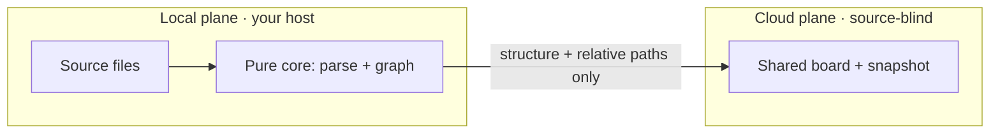

# How it works

codegraph is built on a few deliberate architectural decisions. Understanding them
explains both what the tool can do and the guarantees it makes about your code.

## Two planes, one map

codegraph runs in two planes:

- **The local plane** is source-host-local and open-source. Indexing, parsing, and
  the source viewer all run on your machine. Your code — and the absolute paths to
  it — never leave the host.
- **The cloud plane is source-blind.** Only graph identities, structure, and
  *relative* path metadata can reach the cloud. Never source bytes, never an
  absolute host path. A shared map carries knowledge *about* your code, not the
  code itself.

This is why a snapshot is shareable: it is a portable description of structure and
the agent's knowledge, with the source deliberately left behind.

## A pure core, thin adapters

The codebase is **hexagonal** (ports and adapters):

- The **core** is pure — the node/edge schema, the in-memory graph, projections,
  diff, reachability, the change feed, and the annotation engine. It imports no
  editor API, no filesystem, no network, and no model SDK. That boundary is
  enforced in CI.
- **Adapters** wrap the core with the messy outside world: language parsing, the
  git baseline, the MCP server, the annotation cache, and the webview surface.

One consequence: the same pure core powers the VS Code panel, the standalone web
explorer, and the Vercel deployment, because none of that logic depends on where
it runs.

## Polyglot parsing, no extra runtimes

codegraph parses TypeScript and JavaScript via ts-morph, and Python via Pyright
over the language server protocol — no Python interpreter required. A fast
tree-sitter pass builds the structural skeleton (modules, classes, functions,
methods, and containment), and an accurate pass resolves the cross-file edges:
module dependencies from imports, and `calls` from the type checker.

## The graph model

Every node carries a stable identity and a kind; every edge carries a type
(`calls`, `depends-on`, `contains`, `hands-off-to`). Four **projections** filter
that one model:

- **Full** — everything.
- **Dependency** — module-level `depends-on` edges.
- **Call** — function and method `calls`.
- **Structure** — containment only.

On top of structure sits **reachability**: what a node depends on (forward), and
what depends on it (reverse) — the blast radius of a change.

## The agent moat — no LLM key in the app

codegraph never calls a model. AI-assist builds a grounded prompt for the agent
*you* already use, which answers from the real graph over the codegraph MCP. The
agent writes its understanding back — annotations, Mermaid diagrams, Markdown docs,
notes, and marks — and codegraph caches and renders it. The server and the editor
meet at a shared per-repo cache file, so no API key ever lives in the editor. That
is the moat.

## Read-only, always

The board never mutates your source. Git baselines are materialized in a detached
worktree; annotations write graph metadata only, never code. You can explore
without fear that the tool will touch the tree.

## Next steps

- [How to use it](/how-to-use) — put all of this to work on the board.
- [Getting started](/getting-started) — install and connect your agent.
